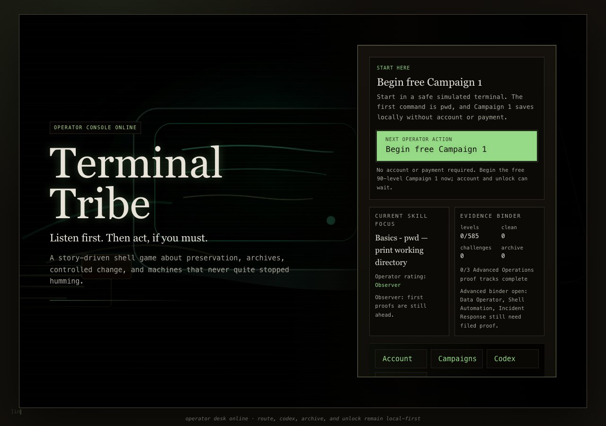
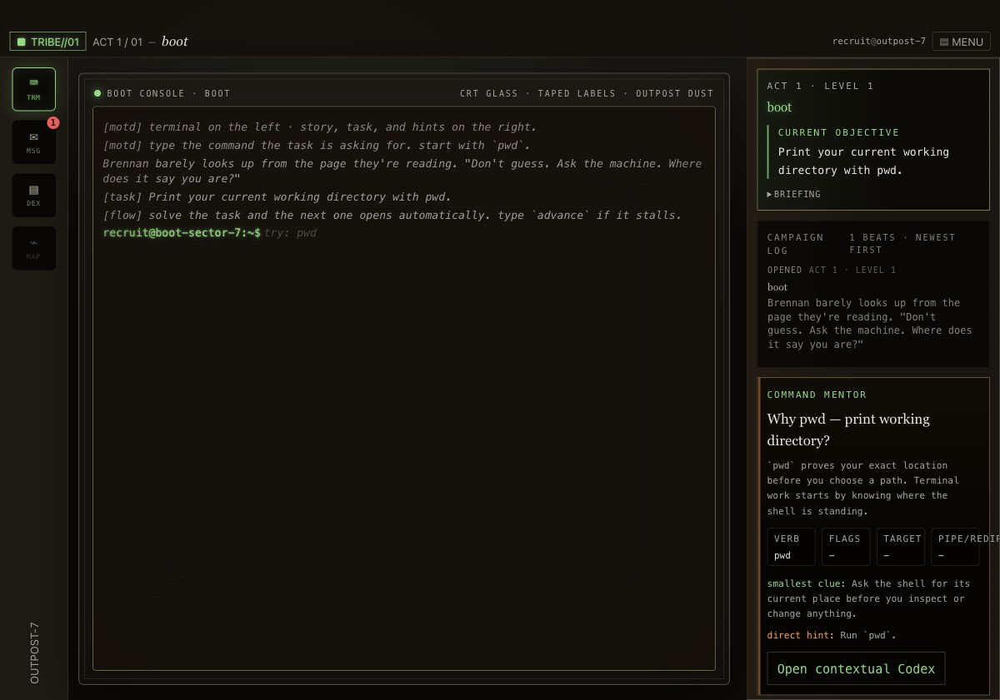
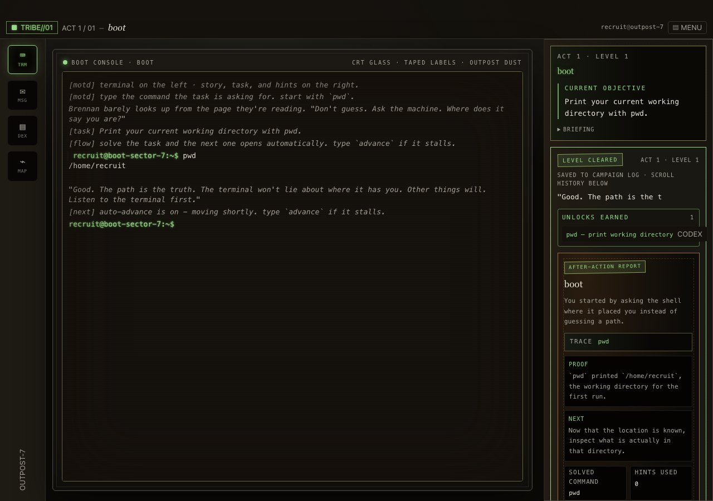
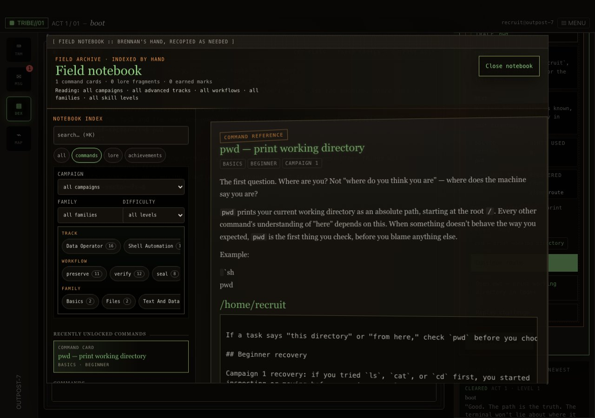

# TerminalTribe

**A story-driven browser game for learning Linux terminal skills.**

[Play TerminalTribe](https://terminaltribe.com/)

<a href="https://terminaltribe.com/">
  
</a>

TerminalTribe is a command-line game and safe terminal simulator. You type real
shell-shaped commands, follow story missions, recover field documents, and build
practical Linux habits without risking your own machine.

This public repository is a promotional pointer. Source code is not available
in this repository.

## How It Plays

Each level gives you a field objective, a simulated terminal, and enough context
to reason about the next command. You enter the command, inspect what changed,
and the game turns that result into evidence, route progress, or a new notebook
entry.

```text
$ pwd
/outpost
$ cp archive/map.txt evidence/
evidence filed: map.txt
```

Each command is tied to a mission result, a recovered artifact, and a clearer
understanding of what the shell just did.

## Gameplay Screenshots

<table>
  <tr>
    <td width="33%">
      
    </td>
    <td width="33%">
      
    </td>
    <td width="33%">
      
    </td>
  </tr>
  <tr>
    <td><strong>Read the objective.</strong><br>Start with a safe simulated terminal and a mission prompt.</td>
    <td><strong>Run the command.</strong><br>See command output, level progress, and after-action proof.</td>
    <td><strong>Keep the evidence.</strong><br>Unlock command references and field notes as you play.</td>
  </tr>
</table>

## What Is Included

- 90 free Campaign 1 missions
- 450 continuation missions across Campaigns 2-6
- 45 Advanced Operations labs
- 585 authored playable levels total
- No account required for Campaign 1

Campaign 1 is free to play in the browser without an account or payment.
Complete Unlock opens the continuation campaigns and Advanced Operations tracks
for Data Operator, Shell Automation, and Incident Response practice.
